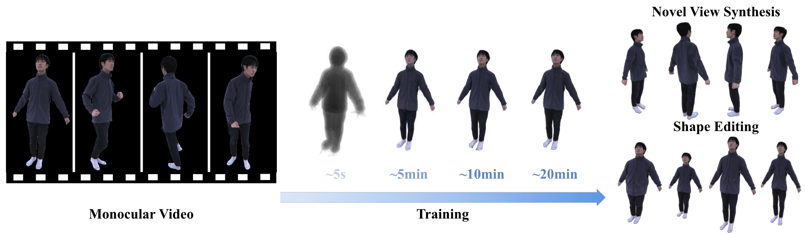
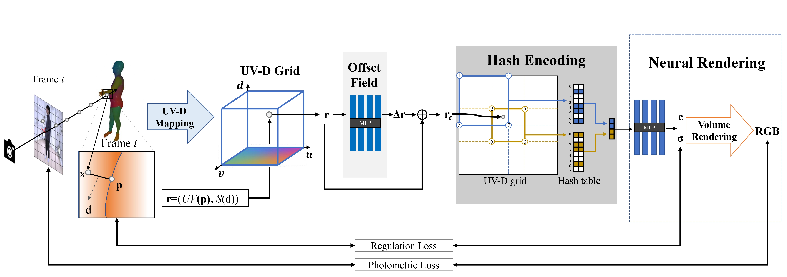

# IntrinsicNGP: Intrinsic Coordinate based Hash Encoding for Human NeRF

PyTorch implementation of the paper "IntrinsicNGP: Intrinsic Coordinate based Hash Encoding for Human NeRF". This repository contains the training and inference code, data.

**|[Project Page](https://ustc3dv.github.io/IntrinsicNGP/)|[Paper](https://arxiv.org/abs/2302.14683)|**

We proposed IntrinsicNGP, an effective and efficient novel view synthesis method for human performers based on the neural radiance field. 

## Pipeline
Overview of our method. Given a sample point at any frame, we first obtain an intrinsic coordinate conditioned on human body surface to aggregate the corresponding point information of different frames. An offset field is proposed to optimize the intrinsic coordinate to model detailed non-rigid deformation. Then we exploit multi-resolution hash encoding to get the feature, which is the encoded input to the NeRF MLP to regress color and density.




## Setup

This code has been tested on RTX 3090. 

Our default, provided install method is:

```
conda create -n Intrinsic-NGP python=3.7.12
conda activate IntrinsicNGP
pip install torch==1.10.0+cu111 torchvision==0.11.0+cu111 torchaudio==0.10.0 -f https://download.pytorch.org/whl/torch_stable.html 
pip install -r requirements.txt
```
Then, install [KNN_CUDA](https://github.com/unlimblue/KNN_CUDA):
```
pip install --upgrade https://github.com/unlimblue/KNN_CUDA/releases/download/0.2/KNN_CUDA-0.2-py3-none-any.whl 
```
Please install nvdiffrast [here](https://nvlabs.github.io/nvdiffrast).


## Train
Download our [preprocessed data](https://drive.google.com/file/d/1HMRxFr-amr31OUFs6CmD7EkYM51A7dnV/view?usp=sharing) and unzip it to `./Data` or organize your own data with the help of [EasyMocap](https://github.com/zju3dv/EasyMocap) in the same folder structure:

```
Data
├── id1
│   ├── 1 #extracted video frames from monocular video
│   ├── mask 
│   │     └── 1 #corresponding mask for human performer 
│   ├── new_params #SMPL parameters of each frames
│   ├── verts # vertices of the rough human meshes
│   ├── face_normal #face normal of the rough human meshes
│   ├── face_center #face center of the rough human meshes
│   ├── mesh_properties #vt,ft,fv,vf of the rough human meshes 
│   └── camera.npy #intrinsics, poses of the tracked camera
│  
├── id2
│   ├── ...
...
```

You also need fill the config file `./configs/custom.yaml` according to our default setting if you want to use your own data. 

Then you could train an IntrinsicNGP model:

```
OMP_NUM_THREADS=8 python main_nerf_exp.py --cfg_file configs/default.yaml #for our default setting and preprocessed data
OMP_NUM_THREADS=8 python main_nerf_exp.py --cfg_file configs/custom.yaml  #for your own custom data
```

It may takes 10-20 mins for compiling the code before training when you first run this command.

This scripts also render novel view synthesis results at the test views of our proposed data. 

## Inference
When training is finished, the checkpoint will be saved in `./exp/the_name_of_workspace/checkpoints`.

To run inference with a given checkpoint: 

```
OMP_NUM_THREADS=8 python main_nerf_exp.py --cfg_file configs/default.yaml --test --test_view1 1 --test_view2 4
```
This means you want to run inference of with `configs/default.yaml`, and the render poses are inperpolated from `test_view1` and `test_view2`


## Citation

If you find our paper useful for your work please cite:

```
@article{peng2023intrinsicngp,
  title={IntrinsicNGP: Intrinsic Coordinate based Hash Encoding for Human NeRF},
  author={Peng, Bo and Hu, Jun and Zhou, Jingtao and Gao, Xuan and Zhang, Juyong},
  journal={IEEE Transactions on Visualization and Computer Graphics},
  year={2023}，
  publisher={IEEE}
}
```

## Acknowledgement

This code is developed on [torch-ngp](https://github.com/ashawkey/torch-ngp) code base. 

```
@misc{torch-ngp,
    Author = {Jiaxiang Tang},
    Year = {2022},
    Note = {https://github.com/ashawkey/torch-ngp},
    Title = {Torch-ngp: a PyTorch implementation of instant-ngp}
}
```
Our data is processed with the help of [EasyMocap](https://github.com/zju3dv/EasyMocap) and [MiVOS](https://github.com/hkchengrex/MiVOS):
```
@Misc{easymocap,  
    title = {EasyMoCap - Make human motion capture easier.},
    howpublished = {Github},  
    year = {2021},
    url = {https://github.com/zju3dv/EasyMocap}
}

@inproceedings{cheng2021mivos,
  title={Modular Interactive Video Object Segmentation: Interaction-to-Mask, Propagation and Difference-Aware Fusion},
  author={Cheng, Ho Kei and Tai, Yu-Wing and Tang, Chi-Keung},
  booktitle={CVPR},
  year={2021}
}
```
